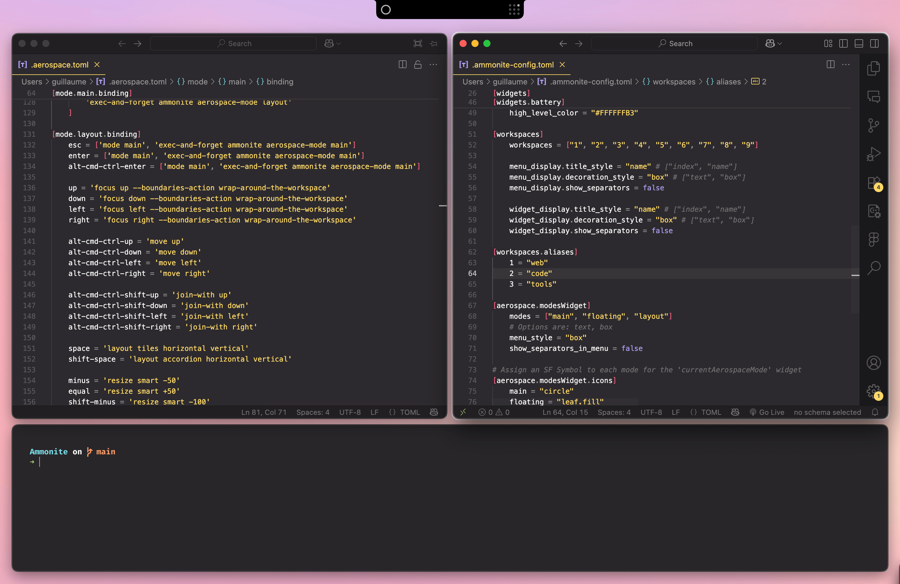
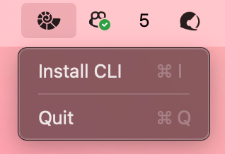

# Ammonite

*Notch widgets for the [Aerospace](https://github.com/nikitabobko/AeroSpace) tiling window manager.*

 
  

## Quick Start

```
brew tap Morniak/ammonite 
brew install ammonite-notch
open -a Ammonite
```
Then, you might want to install the [Ammonite CLI](#cli).

---

## Using Ammonite with Aerospace

If you’d like to start **Ammonite** automatically with Aerospace, add this to your `.aerospace.toml`:

```toml
# aerospace.toml

after-startup-command = [
  'exec-and-forget open -a Ammonite'
]
```

To keep Ammonite in sync when you switch workspaces, install the [Ammonite CLI](#cli) and add:

```toml
# aerospace.toml

exec-on-workspace-change = ['/bin/bash', '-c',
  'ammonite workspace-change $AEROSPACE_FOCUSED_WORKSPACE'
]
```

Since Aerospace does not provide a callback for changes to the binding mode, you need to manually call the [Ammonite CLI](#cli) for every shortcut that changes the binding mode.

```toml
# aerospace.toml

[mode.main.binding]
    alt-cmd-ctrl-enter = [
        'mode layout',
        'exec-and-forget ammonite aerospace-mode layout'
    ]

[mode.layout.binding]
    esc = ['mode main', 'exec-and-forget ammonite aerospace-mode main']
```

---

## Configuration

On first launch, `~/ammonite.toml` file will be created:

```toml
[appearance]
    notch_width = 184.0
    notch_height = 32.0
    notch_corner_radius = 10.0

    outer_padding = 10.0
    inner_padding = 10.0
    items_spacing = 6.0

    # Colors can be RGB hex, RGBA hex, or one of the following named materials:
    # ["regular material", "thick material", "thin material", "ultra-thick material", "ultra-thin material"]
    primary_color = "#FFFFFFB3"
    secondary_color = "#FFFFFF4D"
    bar_background_color = "ultra-thick material"
    menu_background_color = "regular material"

    # You can customize the font using its PostScript name.
    # This name can be found in the Font Book app’s info pane.
    # font.name = "FiraCode-Medium"
    # font.size = 12

# Available widgets:
# ["digital-clock", "analog-clock", "current-workspace-index", "current-workspace-letter", "workspace-grid", "current-aerospace-mode", "battery", "network", "keyboard-layout", "workspace-next", "workspace-prev", "storage", "date-time", "workspaces", "aerospace-modes", "separator"]
[widgets]
    left_bar = []
    left_notch = "current-aerospace-mode"
    right_notch = "current-workspace-index"
    right_bar = []

[workspaces]
    # Define workspace names/IDs here and/or manage them dynamically via the CLI.
    # Use workspace.current to set the initial workspace, then update it through the CLI.
    # Example:
    # workspaces = ["1", "2", ...]
    # current = "1"

    menu_display.title_style = "name"	# ["index", "name"]
    menu_display.decoration_style = "box"	# ["text", "box"]
    menu_display.show_separators = false

    widget_display.title_style = "name"	# ["index", "name"]
    widget_display.decoration_style = "box"	# ["text", "box"]
    widget_display.show_separators = false

# Use aliases to override the display names of your tiling window manager’s workspaces.
# This is especially useful with window managers like Aerospace, which sort workspaces alphabetically.
#
# Example: show workspace 1 as 'web' within Ammonite
#
# [workspaces.aliases]
#   1 = "web"

# If you installed Aerospace without Homebrew,
# you can manually set the path to the binary:
#
# aerospace.path = "/usr/local/bin/aerospace"

# Configuration for the widgets that show Aerospace binding modes:
[aerospace.modesWidget]
    modes = ["main"]
    menu_style = "box"	#text, box
    show_separators_in_menu = false

# Assign SF Symbols to each Aerospace mode for the 'currentAerospaceMode' widget
[aerospace.modesWidget.icons]
    main = "circle"
```

---

## Widgets

Below is a list of available widgets. Only fixed-size square widgets can appear in the notch area (marked with the ✅ emoji).

### `digital-clock` & `analog-clock` ✅
Show the current time in either digital or analog style.

### `current-workspace-index` & `current-workspace-letter` ✅
Display the current Aerospace binding mode, as an initial letter or an SF Symbol icon.

### `workspace-next` & `workspace-prev` ✅
Buttons to navigate to the previous/next workspace.

### `workspace-grid` ✅  
Displays a dot grid representing workspaces — works best with 4 or 9 workspaces.

### `current-aerospace-mode` ✅  
Displays the first letter of the binding mode, or an SF Symbol icon:
```toml
[aerospace.modesWidget.icons]
main = "circle"
floating = "leaf.fill"
layout = "arrow.up.left.and.down.right.and.arrow.up.right.and.down.left"
```

### `battery` ✅
Show the current battery level and charging status.

```toml
[widgets.battery]
    showPercentage = true
    isMonochrome = false # if true, colors below will be ignored and appearance.primaryColor will be used
    lowLevelColor = "#FF0000B3"
    mediumLevelColor = "#FFFF00B3"
    highLevelColor = "#00FF00B3"
```

### `network` ✅
Show the current network status, such as Wi-Fi or Ethernet connectivity.

### `keyboard-layout` ✅
Show the active keyboard layout. Click to switch between layouts.

### `storage`
Display the number of connected external storage devices.

### `date-time`
Show the current date and time. You can use a custom format and locale.:

```toml
[widgets.dateTime]
format = "EEE d MMM HH:mm"
locale = "fr"
```

### `workspaces`
Show a list of all Aerospace workspaces and switch between them.

Appearance can be configured like that:
```toml
[workspaces.widgetDisplay]
    titleStyle = "name" # name, index
    decorationStyle = "text" # text, box
    showSeparators = true
```

### `aerospaceModes`
Show a list of all Aerospace binding modes and switch between them.

---

## CLI

The command-line interface lets you interact with the main app easily. You can install it directly from the Ammonite status bar icon.  
If you prefer to install it manually, the binary is located inside the Ammonite.app package under `Contents/Resources/`.  



Run `ammonite help` and `ammonite help <subcommand>` for a detailed help.
